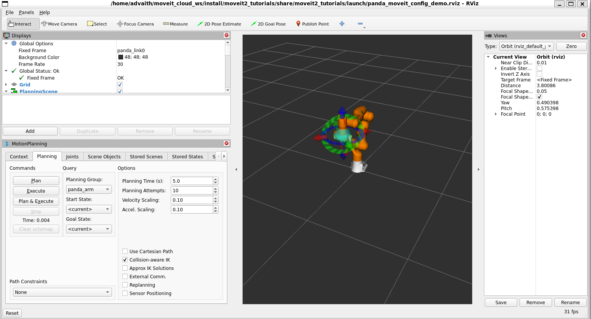

# Results

| Scenario                  | Latency  | Improvement     |
|---------------------------|----------|-----------------|
| Local Planning (MoveIt)   | 0.487s   | -               |
| Cloud Offload             | **0.305s** | **36% faster** |
| Logistics (Synthetic)     | **0.298s** | **39% faster** |

> **Cloud offloading reduces planning latency by up to 39%**

---

### Screenshots

**RViz Planning Scene**  

**Cloud Offloading Log**  

**Logistics Extension Log**  

